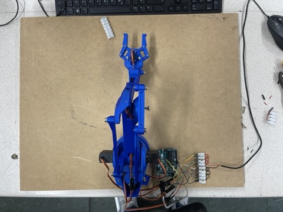
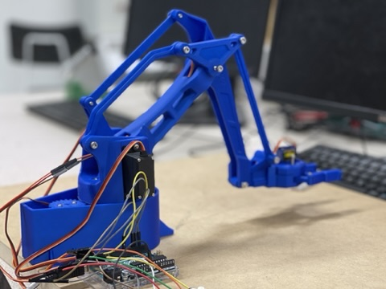
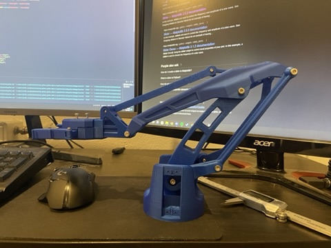
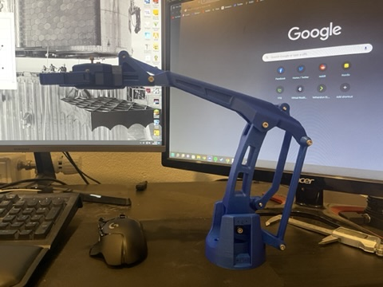

Róbot armur stjórnað með handaskynjun — Lokaverkefni í Rafvirkjun

Verkefni
-
Ekki kóði sem ég tel mig vera stoltan af lengur, þó ég vissi svosem helstu galla á sínum tíma líka (bræddi úr einum mótor því ég var ekki búinn að limita max og min gildi á hreyfingu mótoranna).
Handaskynjun fór fram með mediapipe, með mediapipe gat ég fengið hnit af mörgum punktum handarinnar. X og Y ásinn voru þægilegir, bara hvar hendin var staðsett í rammanum. Fyrir Z hnitin notaði í 2 punkta handarinnar og reiknaði hversu langt í burt þeir væru til að fá fjarlægð frá myndavél. Til að klemma utan um hluti með arminum reiknaði ég lengd á milli vísifingurs og þumalputta til að geta klemmt með því að klemma í raun.

Repo
- `Code/` — Python kóði notaður til að keyra. Ekki skrifaður til að virka á öllum vélum
- `Images/` — Myndir af arm og ferli. Hefði átt að vera taka fleiri.
- `Report/` — Lokaskýrsla og kynning.

Myndbönd af virkni

https://youtube.com/shorts/UqYZ2Au9yfY?feature=share

https://youtu.be/y-wodEQewyk

**Image Gallery**

